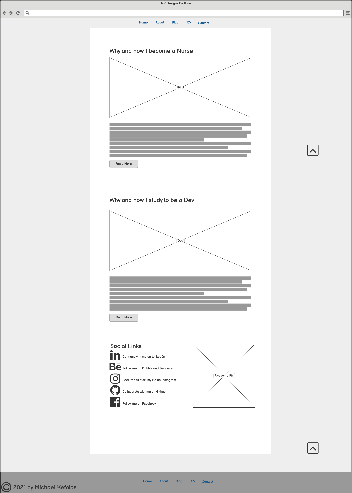
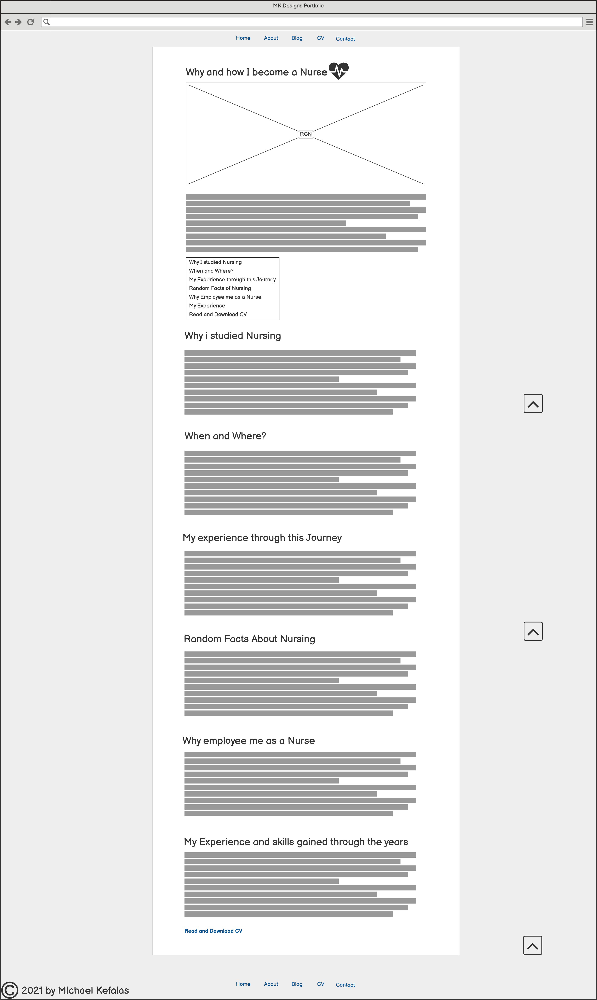

<h1 align="center">MK Designs Portfolio</h1>

[MK | Designs Portfolio Website]( https://frangelicomk.github.io/MK-PortfolioWeb-MS1/)

This is my first personal portfolio website. It is designed to be accessible and responsive on a range of 
devices and easy to navigate for better UX for future recruiters, employers and collaborators. As I do not 
have exprerience yet as a Developer this site will future both qualifications my Nursing background and work 
history as my Full Stack Developer in progress/ongoing.
<h1 align="center"><--Image--></h1>

## Table of contents
1. [User Experience (UX)](#user-experience-ux)
    + User Stories
    + Design
    + Wireframes
2. [Features](#features) 
    + Existing Features
    + Upcoming Features
3. [Technologies Used](#technologies-used)
    + Languages Used
    + Frameworks, Libraries & Progragms Used
4. [Testing](#testing)
5. [Credits](#credits) 

## User Experience (UX)

+ ### User Stories
    + First Time Visitors
    + Returing Visitors
    + Frequent Visitors (such as Recruiters/employers/collaborators)
+ ### Design
+ ### Wireframes
    <h3 align="center">Home Wireframe</h3>

    

    <h3 align="center">About Wireframe</h3>

    

    <h3 align="center">Blog Wireframe</h3>

    

    

    

    <h3 align="center">Contact Wireframe</h3>

    

    <h3 align="center">CV Wireframe</h3>

    

Download my Wireframes as PDF [Here!](assets\wireframes\My Personal Portfolio Website.pdf)

## Features

+ Responsive on all device sizes
+ Interactive Elements 
+ Animation done in CSS3
+ Pure awesome :)
## Technologies Used 

### Languages Used
+ [HTML 5](https://en.wikipedia.org/wiki/HTML5)
+ [CSS3](https://en.wikipedia.org/wiki/CSS)

### Frameworks, Libraries & Programs Used
1. [Bootstrap v4.3](https://en.wikipedia.org/wiki/Bootstrap_(front-end_framework))
    + Bootstrap was used to assist with the responsiveness and some styling of the website
2. [Hover.css](https://ianlunn.github.io/Hover/)
    + Hover.css used for styling effects on buttons and links
3. [Font Awesome](https://fontawesome.com)
    + Font Awesome used for widgets and icons
4. [Clip Path](https://www.cssportal.com/css-clip-path-generator/)
    + Clip Path used for the design and animation of the hero image
5. [Git](https://git-scm.com)
    + Git was used for version control by utilizing the Gitpod terminal to commit to Git and Push to GitHub.
6. [Github](https://github.com)
    + GitHub is used to store the projects code after being pushed from Git.
7. [Photoshop](https://www.adobe.com/ie/products/photoshop.html)
    + Photoshop was used to create the logo, resizing images and editing photos for the website.
8. [Adobe Illustrator](https://www.adobe.com/uk/products/illustrator.html)
    + Adobe Illustrator was used to create the logo, vector images for responsiveness
9. [Balsamiq](https://balsamiq.com)
    + Balsamiq was used to create the wireframes during the design process.
## Testing

The W3C Markup Validator and W3C CSS Validator Services were used to validate every page of  the project to ensure there were no syntax errors in the project.
+ [W3C Markup Validator](https://validator.w3.org/#validate_by_uri+with_options)
+ [W3C CSS Validator](https://jigsaw.w3.org/css-validator/#validate_by_input)
+ [Color Contrast Checker](https://color.a11y.com/)
### Testing User Stories
+ User Stories
+ Tested by friends from facebook and colleagues in differnt divices
+ Feedback

### Further Testing
+ The Website was tested on Google Chrome, Internet Explorer, Microsoft Edge, Opera and Safari browsers.
+ The website was viewed on a variety of devices such as Desktop, Laptop, Samsung S8, Samsung S20 Ultra and iPhoneX.
+ A large amount of testing was done to ensure that all pages were linking correctly. 
+ Friends, Colleagues from work and family members were asked to review the site and documentation  to point out any bugs and/or user experience issues.
+ [Typeform](https://www.typeform.com/) used for feedback , I had the basic plan so i will try to attach it on my websites contact form.

### Difficulties Encountered & Bugs
+ Most difficult part is the design and animation of the Hero Image on Hover effect with lighting correctly, as i want  
done by using only pure CSS - This wasnt solved yet as it was difficult to be managed with CSS at my current level but in the future i will work
more on the animation part.
+ Read More does not work as intended looking for a solution regarding this.
    - 29.04.2021: I have solved the issue with read more buttons, I have found the solution in [Stackoverflow](https://stackoverflow.com/questions/710089/how-do-i-make-an-html-link-look-like-a-button)

## Credits

### Code
+ [Bootstrap v4.3](https://en.wikipedia.org/wiki/Bootstrap_(front-end_framework)) Library used throughout the project mainly to make site responsive using the Bootstrap Grid System.
+ All code was written by Michael Kefalas

### Content 
+ All content was written by Developer and Designer Michael Kefalas
+ Psychological properties of colours text in the README.md was found [here](http://www.colour-affects.co.uk/psychological-properties-of-colours)

### Media 
+ Images Created by Michael Kefalas
+ Logo Crated by Michael Kefalas in [Adobe Illustrator](https://www.adobe.com/uk/products/illustrator.html) and a mock up was created on [Logomakr](https://logomakr.com)

### Acknoledgements 
+ [Adobe](https://www.adobe.com/#) for their tutorials and videos in their youtube channel found [here](https://www.youtube.com/user/AdobeCreativeCloud)
+ Random youtubers which i got inspired from will list some later
+ My Mentor at code institute 
+ Fellow Coders from [Slack](https://slack.com/intl/en-gb/)

